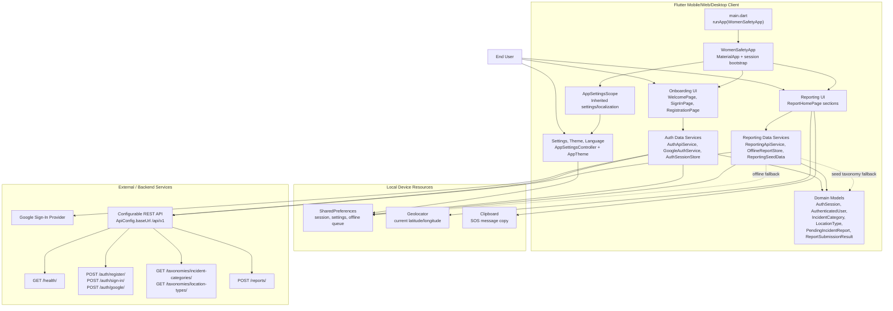
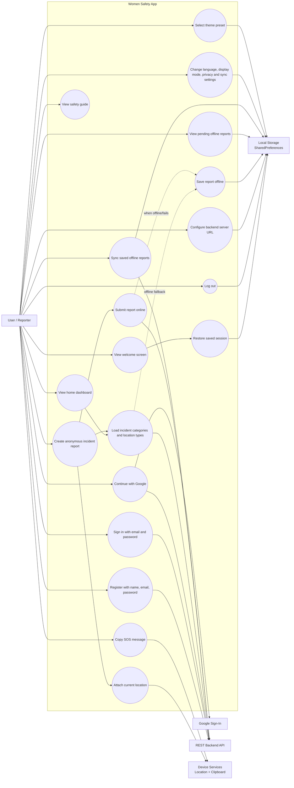

# ANONYMUS / Women Safety App Diagrams

These diagrams are based on the Flutter source under `lib/`. Platform runner files and small private decorative widgets are grouped so the diagrams stay readable.

## 1. System Architecture Diagram

## 2. Class Diagram

```mermaid
classDiagram
    class WomenSafetyApp {
        -AppSettingsController settingsController
        -AuthSessionStore sessionStore
        -AuthSession? session
        -bool isBootstrapping
        +build(BuildContext) Widget
        -bootstrapApp() Future~void~
        -handleAuthenticated(AuthSession) Future~void~
        -handleLoggedOut() Future~void~
    }

    class AppSettingsScope {
        +controllerOf(BuildContext) AppSettingsController
        +readControllerOf(BuildContext) AppSettingsController
        +stringsOf(BuildContext) AppStrings
        +readStringsOf(BuildContext) AppStrings
    }

    class AppSettingsController {
        -AppLanguage language
        -ThemeMode themeMode
        -AppThemePreset themePreset
        -bool autoSyncEnabled
        -bool locationHintsEnabled
        -bool privacyTipsEnabled
        -String backendUrl
        +load() Future~void~
        +setLanguage(AppLanguage) void
        +setThemeMode(ThemeMode) void
        +setThemePreset(AppThemePreset) void
        +setAutoSyncEnabled(bool) void
        +setLocationHintsEnabled(bool) void
        +setPrivacyTipsEnabled(bool) void
        +setBackendUrl(String) Future~void~
    }

    class AppLanguage {
        <<enumeration>>
        english
        swahili
    }

    class AppThemePreset {
        <<enumeration>>
        roseDawn
        oceanCalm
        emeraldGlow
    }

    class AppStrings {
        -AppLanguage language
        +text(String, Map) String
        +languageName(AppLanguage) String
        +themeModeName(ThemeMode) String
        +themePresetName(AppThemePreset) String
        +categoryName(String, String) String
        +locationTypeName(String, String) String
        +statusLabel(String) String
    }

    class AppTheme {
        +light(AppThemePreset) ThemeData
        +dark(AppThemePreset) ThemeData
    }

    class AppPalette {
        +visualsFor(AppThemePreset, Brightness) AppThemeVisuals
    }

    class AppThemeVisuals {
        +Color pageBackground
        +Color cardSurface
        +Color primary
        +Color deep
        +copyWith() AppThemeVisuals
        +lerp(ThemeExtension, double) AppThemeVisuals
    }

    class ApiConfig {
        +defaultBaseUrl String
        +baseUrl String
        +setSavedBaseUrl(String?) void
        +normalizeBaseUrl(String?, String) String
    }

    class GoogleAuthConfig {
        +serverClientId String?
        +isConfigured bool
    }

    class WelcomePage {
        +onAuthenticated(AuthSession) Future~void~
        +build(BuildContext) Widget
    }

    class SignInPage {
        +onAuthenticated(AuthSession) Future~void~
    }

    class RegistrationPage {
        +onAuthenticated(AuthSession) Future~void~
    }

    class ReportHomePage {
        +AuthenticatedUser currentUser
        +onLogout() Future~void~
    }

    class ReportHomePageState {
        -ReportingApiService api
        -OfflineReportStore offlineStore
        -List~IncidentCategory~ categories
        -List~LocationType~ locationTypes
        -List~PendingIncidentReport~ pendingReports
        -ReportSubmissionResult? lastSubmission
        -captureCurrentPosition() Future~Position~
        -useCurrentLocation() Future~void~
        -activateSosSupport() Future~void~
        -submit() Future~void~
        -queueCurrentReportOffline() Future~ReportSubmissionResult~
        -syncPendingReports() Future~void~
    }

    class AuthApiService {
        -http.Client client
        +register(String, String, String) Future~AuthSession~
        +signIn(String, String) Future~AuthSession~
        +signInWithGoogle(String) Future~AuthSession~
        +isConnectivityError(Object) bool
    }

    class GoogleAuthService {
        -GoogleSignIn signIn
        -bool isInitialized
        +authenticate() Future~GoogleAuthResult~
    }

    class AuthSessionStore {
        +loadSession() Future~AuthSession?~
        +saveSession(AuthSession) Future~void~
        +clearSession() Future~void~
    }

    class ReportingApiService {
        -http.Client client
        +isBackendAvailable() Future~bool~
        +fetchIncidentCategories() Future
        +fetchLocationTypes() Future
        +submitReport(...) Future~ReportSubmissionResult~
        +isConnectivityError(Object) bool
    }

    class OfflineReportStore {
        +loadPendingReports() Future
        +enqueueReport(PendingIncidentReport) Future~void~
        +savePendingReports(List~PendingIncidentReport~) Future~void~
    }

    class ReportingSeedData {
        +incidentCategories List~IncidentCategory~
        +locationTypes List~LocationType~
    }

    class AuthenticatedUser {
        +int id
        +String fullName
        +String email
        +toJson() Map
        +fromJson(Map) AuthenticatedUser
    }

    class AuthSession {
        +String token
        +AuthenticatedUser user
        +toJson() Map
        +fromJson(Map) AuthSession
        +fromAuthResponse(Map) AuthSession
    }

    class GoogleAuthResult {
        +String idToken
        +String email
        +String? displayName
    }

    class IncidentCategory {
        +String id
        +String code
        +String name
        +String? description
        +int sortOrder
        +fromJson(Map) IncidentCategory
    }

    class LocationType {
        +String id
        +String code
        +String name
        +String? description
        +int sortOrder
        +fromJson(Map) LocationType
    }

    class PendingIncidentReport {
        +String localId
        +String categoryCode
        +String locationTypeCode
        +DateTime occurredAt
        +double latitude
        +double longitude
        +String approxAreaName
        +String wardOrDistrict
        +String description
        +String languageCode
        +bool consentAcknowledged
        +DateTime queuedAt
        +toJson() Map
        +fromJson(Map) PendingIncidentReport
    }

    class ReportSubmissionResult {
        +String id
        +String publicReference
        +String status
        +String message
        +fromJson(Map) ReportSubmissionResult
        +offlineQueued(String, int) ReportSubmissionResult
    }

    class AuthApiException
    class ReportingApiException
    class GoogleAuthException
    class GoogleAuthNotConfiguredException
    class GoogleAuthCancelledException
    class GoogleAuthFailedException

    WomenSafetyApp *-- AppSettingsController
    WomenSafetyApp *-- AuthSessionStore
    WomenSafetyApp o-- AuthSession
    WomenSafetyApp --> WelcomePage
    WomenSafetyApp --> ReportHomePage
    WomenSafetyApp --> AppSettingsScope

    AppSettingsScope o-- AppSettingsController
    AppSettingsScope --> AppStrings
    AppSettingsController --> ApiConfig
    AppSettingsController --> AppThemePreset
    AppSettingsController --> AppLanguage
    AppTheme --> AppPalette
    AppPalette --> AppThemeVisuals
    AppStrings --> AppLanguage
    AppStrings --> AppThemePreset

    WelcomePage --> SignInPage
    WelcomePage --> RegistrationPage
    SignInPage *-- AuthApiService
    SignInPage *-- GoogleAuthService
    RegistrationPage *-- AuthApiService
    RegistrationPage *-- GoogleAuthService

    AuthApiService --> ApiConfig
    AuthApiService --> AuthSession
    GoogleAuthService --> GoogleAuthConfig
    GoogleAuthService --> GoogleAuthResult
    AuthSessionStore --> AuthSession
    AuthSession *-- AuthenticatedUser

    ReportHomePage --> AuthenticatedUser
    ReportHomePage *-- ReportHomePageState
    ReportHomePageState *-- ReportingApiService
    ReportHomePageState *-- OfflineReportStore
    ReportHomePageState o-- IncidentCategory
    ReportHomePageState o-- LocationType
    ReportHomePageState o-- PendingIncidentReport
    ReportHomePageState o-- ReportSubmissionResult
    ReportHomePageState --> ReportingSeedData

    ReportingApiService --> ApiConfig
    ReportingApiService --> IncidentCategory
    ReportingApiService --> LocationType
    ReportingApiService --> ReportSubmissionResult
    OfflineReportStore --> PendingIncidentReport
    ReportingSeedData --> IncidentCategory
    ReportingSeedData --> LocationType

    GoogleAuthNotConfiguredException --|> GoogleAuthException
    GoogleAuthCancelledException --|> GoogleAuthException
    GoogleAuthFailedException --|> GoogleAuthException
```

## 3. Use Case Diagram

